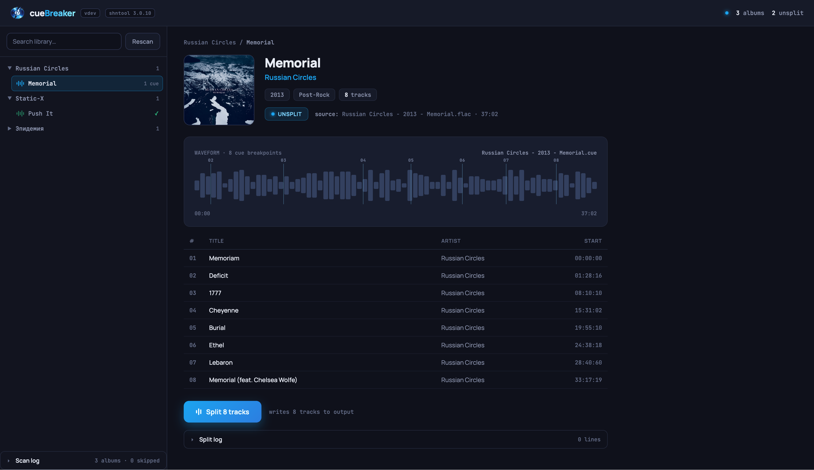

# cueBreaker


**Split single-file FLAC albums into tagged tracks, from your browser.**

A lot of lossless music arrives as a CD image: one big `.flac` per disc and a
`.cue` sheet that says where each track starts. It plays fine end to end, and
badly everywhere else — no track skipping, no per-track tags, and most players
and library managers treat the whole album as a single 70-minute song.

cueBreaker turns those images into ordinary, properly tagged per-track FLAC files.
Point it at your folder of unsplit albums, pick one, see exactly where the cuts
will fall, and split it. **Your source files are never modified** — the library is
mounted read-only and the tracks are written somewhere else.



## What it does

- **Finds the albums worth splitting.** It walks your library for directories
  holding a CUE sheet plus the single source file it references, and shows them as
  an artist/album tree with search. Albums that are already split — or whose CUE
  points at a missing or multi-file source — are filtered out instead of being
  offered as broken entries. The sidebar log tells you what was skipped and why.
- **Shows you the cuts before you commit.** The album view has the cover, the
  metadata, the source file and its length, and the full track list read straight
  from the CUE. The waveform above it is drawn with the real `INDEX` boundaries
  and a timecode axis, so the split points are visible, not implied.
- **Splits and tags in one click.** `shnsplit` does the cut; each resulting file
  gets its title, artist, album, album artist, track number, year, and genre from
  the CUE; the pregap is dropped and the album cover is copied alongside. The
  output mirrors your library's folder layout under the output directory.
- **Tells you what happened.** A live log streams the whole pipeline — CUE parsed,
  source resolved, breakpoints, each track, tagging, cover, done — and opens itself
  when something fails, showing the underlying tool's own error rather than a
  shrug. Reload the page mid-split and it re-attaches to the running job.
- **Handles real-world CUE sheets.** They come in whatever encoding the ripper
  happened to use — UTF-8 with or without a BOM, Windows-1251, Windows-1252,
  Shift-JIS, EUC-KR, Latin-1. cueBreaker detects the encoding and reads it, rather
  than mangling non-Latin artist and track names.

Splits run one at a time, so a big batch won't thrash your disk.

## Running it

cueBreaker ships as a single Docker image. You need
[Docker](https://docs.docker.com/get-docker/) with Compose and a folder of unsplit
albums.

```bash
cp .env.example .env   # set the host port, your paths, and your UID/GID
mkdir -p output
docker compose up -d
```

Then open **http://localhost:8080** (or whatever `CUEBREAKER_HTTP_PORT` you set).

Your input folder should hold one directory per album, each containing the single
source `.flac` (or `.wav`) and its `.cue` — nested however you like, e.g.
`Artist/2013 - Album/`. Split tracks appear under the output folder in the same
layout.

> **Ownership.** Set `CUEBREAKER_UID` / `CUEBREAKER_GID` to your own (`id -u`,
> `id -g`) so the tracks it writes belong to you and not to root.

### Configuration (`.env`)

| Variable                 | Default                   | What it does                                     |
|--------------------------|---------------------------|--------------------------------------------------|
| `CUEBREAKER_IMAGE`       | `semsemyonoff/cuebreaker` | Image to run                                     |
| `CUEBREAKER_TAG`         | `latest`                  | Image tag — pin to a version in production       |
| `CUEBREAKER_HTTP_PORT`   | `8080`                    | Port the UI is served on                         |
| `CUEBREAKER_INPUT_PATH`  | `./input`                 | Your unsplit albums (mounted **read-only**)      |
| `CUEBREAKER_OUTPUT_PATH` | `./output`                | Where split tracks are written                   |
| `CUEBREAKER_UID`         | `1000`                    | User the container runs as (owns the output)     |
| `CUEBREAKER_GID`         | `1000`                    | Group the container runs as                      |
| `TZ`                     | `UTC`                     | Timezone for logs and timestamps                 |

cueBreaker keeps no database and no persistent state — everything it knows it
reads from your files on each scan.

### Handy commands

A `Makefile` wraps the common operations:

```bash
make up      # start the stack (reads .env)
make down    # stop it
make logs    # tail the logs
make ps      # container status
make pull    # pull a newer image tag
```

### Upgrading

Bump `CUEBREAKER_TAG` in `.env`, then:

```bash
make pull && make up
```

## API

The container serves a JSON API under `/api` alongside the UI, and documents it
itself: the OpenAPI 3.1 spec is at `/api/openapi.yaml` and a browsable reference
at **`/api/docs`**. Both are served from the binary, so they work with no internet
access.

## About this repository

This repo is the deployment layer — the `docker-compose.yml` and `.env.example`
you need to self-host, plus the `Dockerfile` that builds the published image. The
application source lives in separate repositories, pinned here as submodules and
bundled into the image; you don't need them to run cueBreaker.

| Submodule   | Role                                                          |
|-------------|---------------------------------------------------------------|
| `backend/`  | Go server — JSON API, splitter orchestration, serves the SPA   |
| `frontend/` | React + Vite + TypeScript SPA, built into the backend binary   |

One product version = one image = one pinned (`backend`, `frontend`) pair. See
[CHANGELOG.md](CHANGELOG.md) for what shipped when.

## Credits

The heavy lifting is done by long-standing command-line tools, bundled in the
image: [shntool](http://www.etree.org/shnutils/shntool/) (`shnsplit`),
[cuetools](https://github.com/svend/cuetools) (`cuebreakpoints`, `cueprint`), and
[FLAC](https://xiph.org/flac/) (`metaflac`). cueBreaker is the UI, the library
scanner, and the glue.

## License

MIT.
